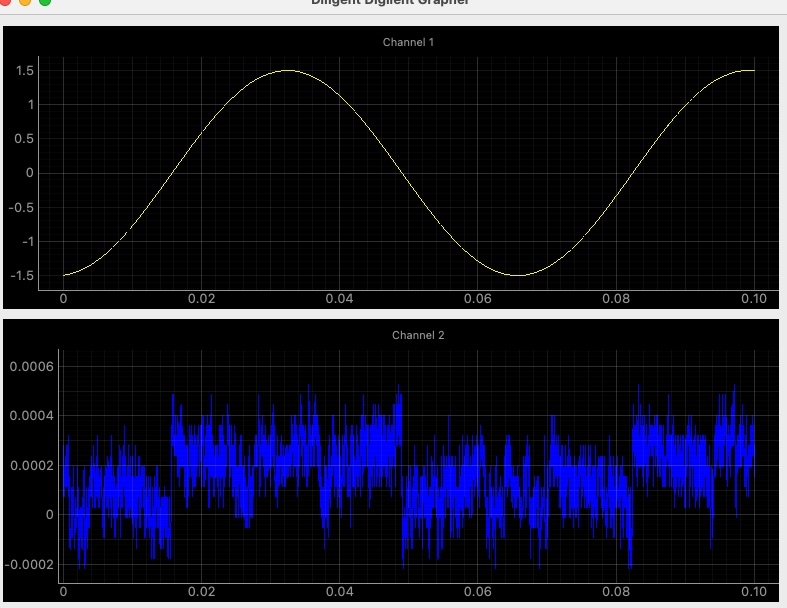

# dwfpy-ux
Digilent Waveforms API facade with optional UIX

## Overview
`dwfpy-ux` provides a Python interface to Digilent oscilloscope hardware using the Waveforms SDK. This library simplifies device connection, configuration, and data acquisition for Digilent oscilloscope devices.

## Features
- Easy device connection and configuration
- Support for various trigger modes (edge, pulse, auto)
- Channel configuration with customizable ranges, offsets, and coupling
- Single and continuous acquisition modes
- Waveform generation for testing
- Data export as pandas DataFrames
- Real-time data visualization GUI for monitoring oscilloscope signals

## Requirements
- Python 3.6+
- NumPy
- Pandas
- Digilent Waveforms SDK (dwf library)
- PyQt5
- pyqtgraph
- pglive

## Installation
1. Install the Digilent Waveforms SDK from [Digilent's website](https://digilent.com/reference/software/waveforms/waveforms-3/start)
2. Install the package using pip:
```
pip install dwfpy-ux
```

Or install from source:
```
git clone https://github.com/yourusername/dwfpy-ux.git
cd dwfpy-ux
pip install -e .
```

## Quick Start
```python
from DwfInterface import DigiScope
from DwfInterface import dwfconstants as DConsts

# Create a DigiScope instance
ds = DigiScope()

# Configure oscilloscope parameters
params = {
    1: {    
        "range": 5.0,
        "offset": 0.0,
        "enable": 1,
        "coupling": DConsts.DwfAnalogCouplingDC,
    },
    2: {
        "range": 5.0,
        "offset": 0.0,
        "enable": 1,
        "coupling": DConsts.DwfAnalogCouplingDC,
    },
    "scope": {
        "frequency": 1e6,
        "samples": 8000,
    },
    "trigger": {
        "type": "edge",
        "channel": 1,
        "level": 2.0,
        "polarity": "+",
        "position": 0.01,
    },
    "wavegen": {
        "waveform": "sine",
        "frequency": 1e6,
        "amplitude": 1.0,
        "offset": 0.0,
    }
}

# Apply configuration
ds.configure_all(params)

# Acquire a single capture
data = ds.acquire_single()

# Data is a pandas DataFrame with time, ch1, ch2 columns
print(data.head())

# Close the device when done
ds.close()
```
Example for repeated acquisitions:
```python
ds = DigiScope()

# Configure oscilloscope parameters
params = {
    1: {    
        "range": 5.0,
        "offset": 0.0,
        "enable": 1,
        "coupling": DConsts.DwfAnalogCouplingDC,
    },
    2: {
        "range": 5.0,
        "offset": 0.0,
        "enable": 1,
        "coupling": DConsts.DwfAnalogCouplingDC,
    },
    "scope": {
        "frequency": 1e6,
        "samples": 8000,
    },
    "trigger": {
        "type": "edge",
        "channel": 1,
        "level": 2.0,
        "polarity": "+",
        "position": 0.01,
    },
    "wavegen": {
        "waveform": "sine",
        "frequency": 1e6,
        "amplitude": 1.0,
        "offset": 0.0,
    }
}

# Apply configuration
ds.configure_all(params)

# Acquire a single capture
data = ds.acquire_series(10, verbose=1)

# Data is a pandas DataFrame with time, ch1, ch2 columns
print(data.head())

# Close the device when done
ds.close()
```

## Using the GUI
The library includes a real-time visualization interface for monitoring oscilloscope data:



```python
from DwfInterface import DigiScope
from DwfInterface.DigiScopeGraph import OscilloscopeUI
import sys
from PyQt5.QtWidgets import QApplication

# Initialize Qt application in main thread
app = get_qt_app()

# Create DigiScope instance
ds = DigiScope()
ds.configure_all(my_params)

# Create UI (will now show the main window)
ds.graph()

print("UI should be visible now. Starting data acquisition...")

# Start acquiring data in a background thread
def run_acquisition():
    # Wait briefly for UI to initialize
    time.sleep(0.5)
    # Acquire continuous data
    ds.acquire_continuous()
    
acquisition_thread = threading.Thread(target=run_acquisition)
acquisition_thread.daemon = True
acquisition_thread.start()

# This blocks until the window is closed
print("Running Qt event loop in main thread. Close window to exit.")
sys.exit(app.exec_())
```

The GUI displays real-time waveforms from both channels with the following features:
- Live updating plots for Channel 1 and Channel 2
- Auto-scaling for optimal signal viewing
- Synchronized x-axis between both channels
- Efficient rendering with configurable sample downsampling

## License
None
